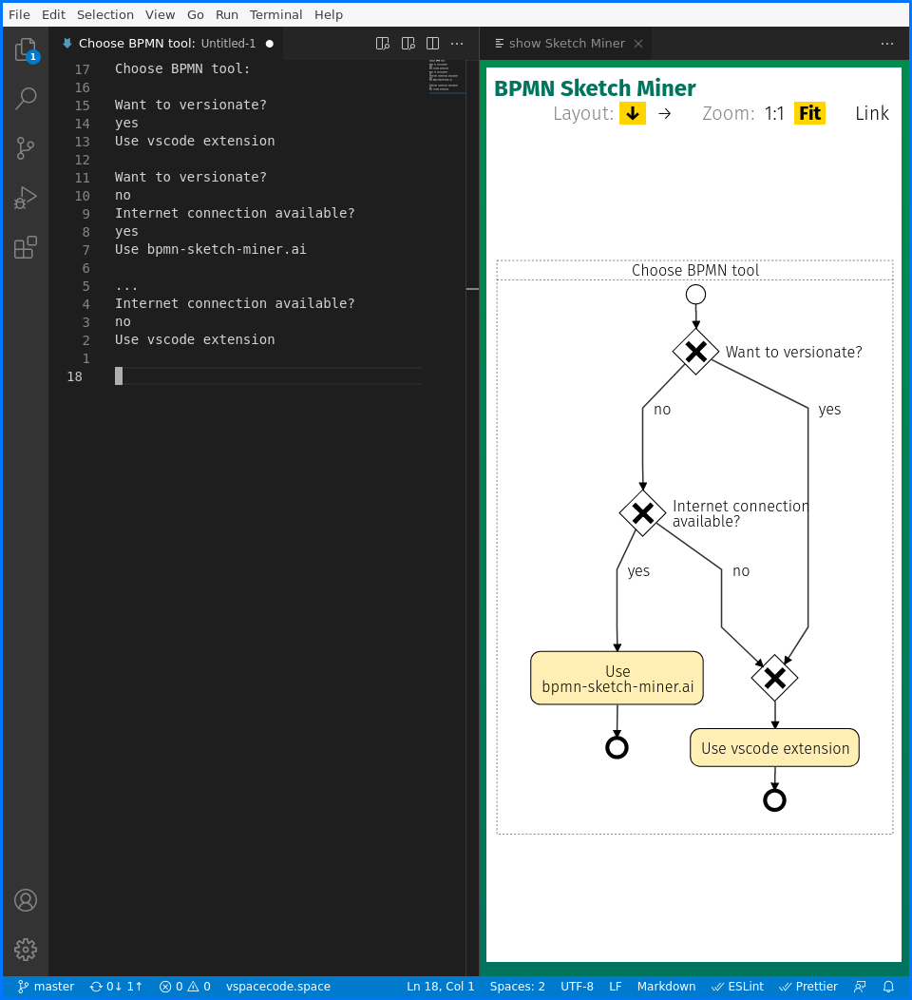

# bpmn-sketch-miner README

Opens a web panel and displays the actual document in [BPMN Sketch Miner](https://www.bpmn-sketch-miner.ai#).

This extension is only a tiny wrapper over BPMN Sketch Miner. The real work is done by [BPMN Sketch Miner](https://www.bpmn-sketch-miner.ai#). 

With [BPMN Sketch Miner](https://www.bpmn-sketch-miner.ai#) you could generate nice BPMN diagramms with simple plain text (similar to plantuml). So you could concentrate on the story behind and don't need to pimp the painting.
Also you could simply share the diagramm with your stakeholders by sharing a link which contains the whole content.

With this extension its further possible to save the text to a file and versionate this file i.e. in git. Also you could use this extension without an active internet connection.

The BPMN diagramm can be written down in simple prosa with some special signs for events, branches etc. For examples and further help, see [BPMN Sketch Miner: Help](https://www.bpmn-sketch-miner.ai/doc/index.html).

## Features

`Show BPMN`: Opens a Web Panel with the BPMN Diagramm generated by [BPMN Sketch Miner](https://www.bpmn-sketch-miner.ai#).

## Configuration

- `generatorSource`
	- local: Use the local js-files
	- hybrid: Use a local web page with remote original [BPMN Sketch Miner](https://www.bpmn-sketch-miner.ai#) js files.
	- web: Use the [BPMN Sketch Miner](https://www.bpmn-sketch-miner.ai#) web site.

## Known Issues

Currently none

## License

This extension is licensed under Apache license 2.0. See [licence file](./LICENSE). This license applies to all source files below the `src` directory. The copyright of all other files is left to their respective owner especially [BPMN Sketch Miner](https://www.bpmn-sketch-miner.ai#).

## Release Notes

### 1.0.0

Initial release 

